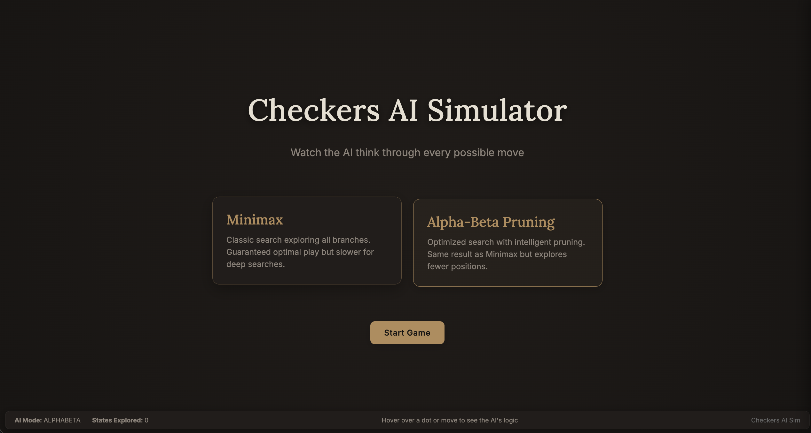
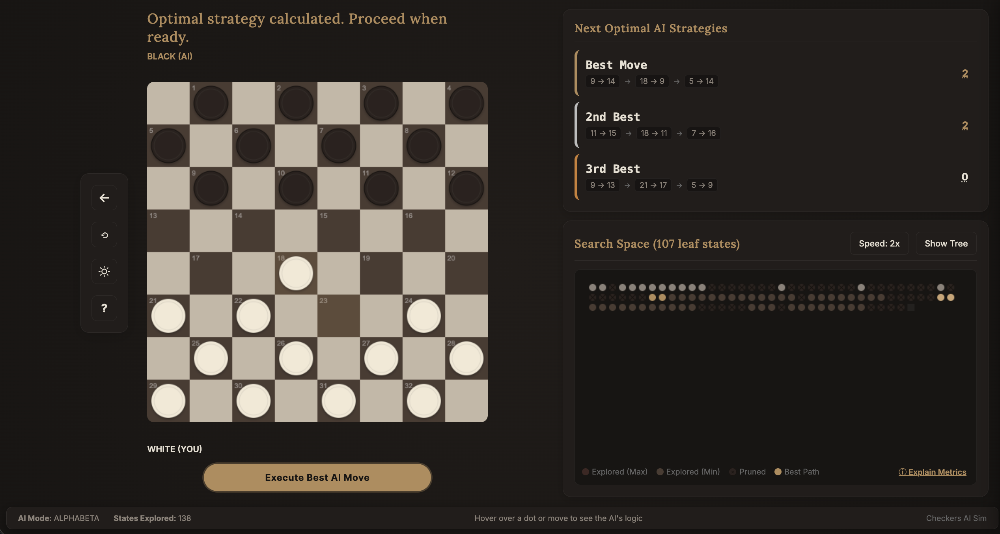
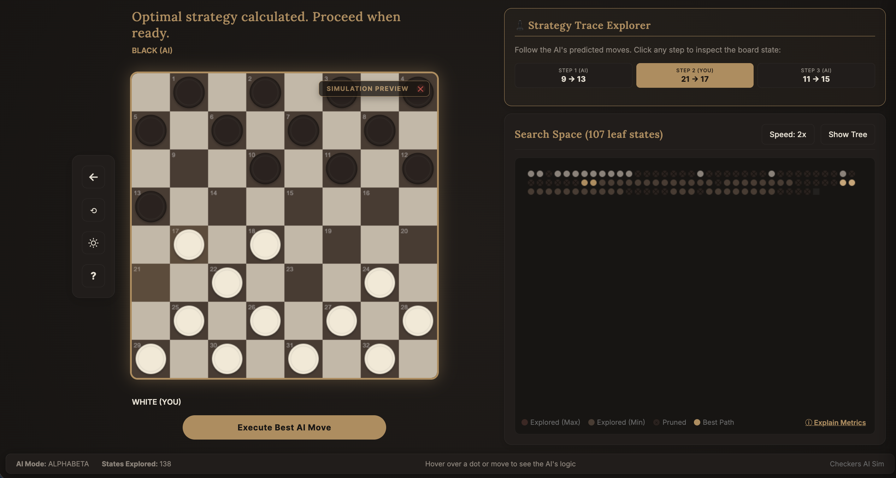

# Checkers Simulator with Search Visualization 🔍

A comprehensive, interactive Checkers simulation featuring **Minimax** and **Alpha-Beta Pruning** bots, coupled with a beautiful web-based visualization of the computer's search tree and decision-making process in real time. The goal of this project is to serve as an educational tool, to help those that are interested, to better understand how popular game engines make decisions. 

### 1. Main Game Board & UI


### 2. Search Tree Visualization


### 3. Simulation Preview


---

## Features

- **Standard Checkers Engine**:
  - Implements official rules: mandatory jumps (force capture), double/multiple jumps, and promotion to Kings.
- **Search Visualization**:
  - **Minimax Decision Making**: Recursively evaluates game states to find optimal outcomes, assuming opponent plays perfectly.
  - **Alpha-Beta Pruning**: Reduces computation by skipping branches that are mathematically proven to yield sub-optimal results.
  - **Simulation Preview**: Hovering over any node in the search tree dynamically updates the checkerboard in a **"Simulation Preview"** mode, showing the exact board state the AI was considering at that depth.
---

## Tech Stack & Architecture

- **Backend**: Python, FastAPI, Uvicorn
- **Frontend**: React (Vite), CSS3 (Variables, Custom Animations), HTML5, SVG (for panning/zooming tree layouts).

---

## 🚀 Setup & Installation

Follow these steps to run the project locally on your machine.

### Prerequisites
Make sure you have the following installed:
- [Python 3.8+](https://www.python.org/downloads/)
- [Node.js v16+](https://nodejs.org/)

---

### Step 1: Clone the Repository
```bash
git clone <repo_url>
cd checkers-sim
```

---

### Step 2: Backend Setup
From the project root directory, create a Python virtual environment and install the required modules:

```bash
# Create virtual environment
python3 -m venv .venv

# Activate virtual environment (macOS/Linux)
source .venv/bin/activate

# Activate virtual environment (Windows)
# .venv\Scripts\activate

# Install required backend dependencies
pip install -r requirements.txt
```

---

### Step 3: Frontend Setup
Navigate to the `frontend` folder and install Node packages:

```bash
# Go to frontend folder
cd frontend

# Install packages
npm install
```

---

## Running the Application

You can run the application in two different modes depending on your needs.

### Option A: Development Mode (Hot Reloading)
This runs the backend API and frontend Vite dev server concurrently in separate terminals. Highly recommended for debugging or code modifications.

1. **Terminal 1 (Backend API)**:
   Ensure your `.venv` is active, then run:
   ```bash
   PYTHONPATH=. python -m src.server
   ```
   *The backend runs at `http://localhost:8000`.*

2. **Terminal 2 (React Frontend)**:
   Navigate to the `frontend` directory and run:
   ```bash
   cd frontend
   npm run dev
   ```
   *Open your browser and visit: `http://localhost:5173`.*

---

### Option B: Production Mode (Single-Port Serving)
This is the easiest way to demonstrate the project. The frontend is built, and the FastAPI backend serves both the API endpoints and the static files from a single port.

1. **Build the frontend assets**:
   ```bash
   cd frontend
   npm run build
   cd ..
   ```
2. **Start the server**:
   Ensure your `.venv` is active, then run:
   ```bash
   PYTHONPATH=. python -m src.server
   ```
3. **Open the browser**:
   Visit `http://localhost:8000` to view the fully self-contained application.

---

## Running Tests
To ensure the backend game state rules and AI components are fully functional, you can run the pytest suite:

```bash
PYTHONPATH=. pytest
```

---
